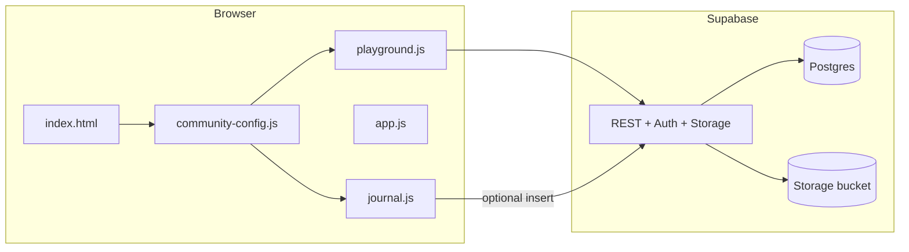

# Fun Corner

Static kids’ site: games, rainbow, facts, a **photo gallery** (owner uploads only), **likes / comments / replies** on each photo, and a **message wall**. Uses [Supabase](https://supabase.com/) Auth + Storage + Postgres.

**Docs policy:** When you change behavior, configuration, or setup in this repo, update this README in the same change so operators and future-you stay aligned. Cursor uses `.cursor/rules/readme-sync.mdc` so assistants follow the same rule.

## Architecture

### What this project is

**Fun Corner** is a **static site** (HTML, CSS, vanilla JavaScript) intended for **GitHub Pages**: no server-side runtime in the repo. Anything “live” (photos, wall, comments, optional journal rows) goes through **HTTPS** to **Supabase** (Postgres + Storage + Auth) using the **anon / publishable key** and, for owner uploads, a **user session JWT** after email sign-in.

### Repository layout

| Path | Role |
|------|------|
| `index.html` | Single page: sections (notice, jokes, rainbow, quote, journal, Scratch, gallery, owner auth, wall, facts), **CSP** meta tag, script tags. |
| `css/styles.css` | Layout, cards, journal UI, gallery, chat, Scratch embed, accessibility. |
| `js/community-config.js` | **`window.FUN_CORNER_REMOTE`**: Supabase URL, key, table/bucket names (never use the service-role key here). |
| `js/playground.js` | Gallery, **Storage** upload (JPEG re-encode to strip metadata), **Auth** sign-in, **REST** calls for messages, comments, likes (`fetch` + `apikey` headers — not `@supabase/supabase-js`). |
| `js/app.js` | **Local-only** interactions: jokes, rainbow game, facts shuffle, **quote of the day** (`DAILY_QUOTES`). |
| `js/journal.js` | **Writing journal**: `TOPICS` / `LEVELS`, `checkConventions` + `gradeWriting`, `localStorage`, optional **POST** to `journalSubmissionsTable`. |
| `.cursor/rules/readme-sync.mdc` | Project rule: keep this README in sync with code changes. |

**Script order (`index.html`):** `community-config.js` loads first (no `defer`, defines `FUN_CORNER_REMOTE`). Then `playground.js`, `app.js`, and `journal.js` with **`defer`** so the DOM is parsed before they run.

### Runtime data flow



- **Owner:** Auth → JWT attached to Storage **insert/delete**; identity checked with `auth.uid()` in Storage RLS.
- **Visitors:** Read photos; **anon REST** for messages, comments, likes (per your RLS). **Voter id** for likes is a random id in `localStorage`, not a login.
- **Journal:** Grading runs **entirely in the browser**. Text leaves the device only if the user opts in to **cloud save** and you configured `journalSubmissionsTable`.

### Security & policy surface

- **CSP** (in `index.html`): `default-src 'self'`; `connect-src` and `img-src` allow `https://*.supabase.co`; **`frame-src`** only `https://scratch.mit.edu` for the Scratch embed; no arbitrary third-party scripts.
- **Secrets:** Only the **publishable** (or legacy anon JWT) key ships in `community-config.js`; RLS and Storage policies enforce what that key can do.
- **Photos:** Client decodes files to pixels and outputs a **new JPEG** before upload to reduce embedded metadata (EXIF/GPS, etc.).

### Grading logic (journal)

| Piece | Where | Notes |
|-------|--------|--------|
| Stars (1–5) | `gradeWriting()` | Word count, sentence count, stretch goals — **not** grammar AI. |
| Convention score (0–100) | `checkConventions()` | Rule-based: sentence caps, end punctuation, lowercase **I**, doubled words, long segments, comma pile-ups, ALL CAPS heuristic; penalty **multiplier** by difficulty (`easy` &lt; `moderate` &lt; `hard`). |
| “We checked” list | Built from the same pass | Per-category pass/fail for the kid-facing checklist. |

---

## Prompts & on-page content

This section is the **catalog of writing prompts and fixed copy** shipped in the repo (source of truth remains the JS files).

### Writing journal — difficulty thresholds (`LEVELS` in `js/journal.js`)

| Level | Min words | Min sentences | Stretch words | Blurb (shown in UI) |
|-------|-----------|---------------|---------------|---------------------|
| Easy | 22 | 2 | 35 | Good for warming up — a few sentences. |
| Moderate | 50 | 4 | 70 | More detail — several sentences with examples or reasons. |
| Hard | 85 | 6 | 115 | Challenge mode — lots of detail, reasons, and clear order. |

**Topic selection:** The dropdown lists all prompts for the active level. On level change, the default index is a **deterministic hash** of date + level (`topicIndex`). **Pick a random title** chooses a uniform random index.

### Writing journal — prompts by level (`TOPICS` in `js/journal.js`)

**Easy**

1. What is your favorite animal? Name it and say one true thing about it.
2. Describe your favorite snack and when you like to eat it.
3. Who makes you laugh? Write one short story about something funny they did.
4. What is the best part of your school day? Say why in a few sentences.
5. If you could design a playground, what two things would you put in it?
6. What book, movie, or show do you like? Say what happens and why you like it.
7. Write about a time you helped someone or someone helped you.
8. What season do you like best (spring, summer, fall, winter)? Give two reasons.
9. Describe your room or a cozy place at home. What do you like there?
10. What would you teach a friend to do? List the steps in order.

**Moderate**

1. Explain how you get ready for school or for bed. Use time words (first, next, then, finally).
2. Describe a hobby or sport you enjoy. What do you do, and what is tricky or fun about it?
3. Write about a goal you have this year. What steps will you take to reach it?
4. Compare two things you like (for example two games or two foods). How are they alike and different?
5. Tell about a problem you solved. What was hard, and what did you try?
6. If you could visit any place for one day, where would you go and what would you do there?
7. Describe a character from a book or movie. What do they want, and how do they act?
8. Why is it important to be a good friend? Give examples of what good friends do.
9. Write about something you are proud of learning. How did you practice?
10. Imagine a new club at school. What is it called, who would join, and what would you do at meetings?

**Hard**

1. Persuade the reader that kids should read or draw every day. Give at least three reasons and a short example for each.
2. Describe a day from morning to night as if you are writing a short story. Use paragraphs and clear order.
3. Explain how to teach a younger kid to do something you know well (tie shoes, ride a bike, a game). Include tips if they get stuck.
4. Write about a time you changed your mind. What did you think first, what happened, and what do you think now?
5. Compare life in a city and life in the country. Use what you know or imagine — include pros and cons for both.
6. If you could change one rule at home or school, what would it be? Explain why, and what might go wrong or right.
7. Describe a problem in your community (litter, kindness, safety) and three ideas kids could do to help.
8. Write a letter to your future self in 5 years. What do you hope you still enjoy? What do you want to remember?
9. Explain the plot of your favorite story without spoiling the ending — then say the theme in one sentence.
10. Imagine you invented a simple machine or app for kids. What problem does it fix, and how would it work?

### Quote of the day (`DAILY_QUOTES` in `js/app.js`)

- **Count:** 60 quotes (authors attributed in the array).
- **Audience:** Short lines aimed at **elementary / middle school** — kindness, effort, curiosity, reading, self-worth.
- **Selection:** `dayNumberForQuote() % DAILY_QUOTES.length` so the quote is **stable for a given calendar day** and cycles through the list across the year. **Edit the array** in `app.js` to change wording or add/remove quotes.

### Silly jokes (`JOKES` in `js/app.js`)

Eight one-liners; the button picks **uniform random** each tap. (No network.)

### Did you know? (`FACTS` in `js/app.js`)

Eight science / nature / fun facts; **Shuffle** randomizes order in the list.

### Rainbow tap (`RAINBOW` / `COLORS` in `js/app.js`)

Six steps in fixed order: **Red → Orange → Yellow → Green → Blue → Purple**. Wrong tap resets the sequence.

### Scratch section (`index.html`)

Static links to scratch.mit.edu, ScratchJr, and an **embedded** project (`iframe`). Replace the project id in the embed URL to change the demo.

---

## 1. Supabase Auth (owner account)

1. Dashboard → **Authentication** → **Providers** → enable **Email**.
2. **Authentication** → **Sign In / Providers** → turn **off** “Allow new users to sign up” (recommended) so random people cannot create accounts.
3. **Authentication** → **Users** → **Add user** → enter **your** email and password. This is the **owner** who can upload/delete photos.
4. Copy that user’s **User UID** (UUID). You will paste it into SQL in step 3 below.

## 2. Database: messages (if not already created)

```sql
create table if not exists fc_messages (
  id uuid primary key default gen_random_uuid(),
  created_at timestamptz not null default now(),
  author text not null,
  body text not null,
  constraint author_len check (char_length(author) <= 24),
  constraint body_len check (char_length(body) <= 500)
);

alter table fc_messages enable row level security;

drop policy if exists "Anyone can read messages" on fc_messages;
drop policy if exists "Anyone can insert messages" on fc_messages;

create policy "Anyone can read messages"
  on fc_messages for select using (true);

create policy "Anyone can insert messages"
  on fc_messages for insert with check (true);
```

## 3. Storage: only **you** upload/delete photos

Replace `YOUR_AUTH_USER_UUID` with the UUID from **Authentication → Users** (step 1).

```sql
-- Bucket (public read so  works)
insert into storage.buckets (id, name, public)
values ('fc-photos', 'fc-photos', true)
on conflict (id) do update set public = excluded.public;

-- Remove old open policies if you ran the previous README
drop policy if exists "fc-photos read" on storage.objects;
drop policy if exists "fc-photos insert" on storage.objects;
drop policy if exists "fc-photos delete" on storage.objects;
drop policy if exists "fc photos read" on storage.objects;
drop policy if exists "fc photos insert" on storage.objects;
drop policy if exists "fc photos delete" on storage.objects;

-- Anyone can view images
create policy "fc-photos read"
  on storage.objects for select
  using (bucket_id = 'fc-photos');

-- Only your Auth user can upload
create policy "fc-photos insert owner"
  on storage.objects for insert
  with check (
    bucket_id = 'fc-photos'
    and auth.uid() = 'YOUR_AUTH_USER_UUID'::uuid
  );

-- Only your Auth user can delete
create policy "fc-photos delete owner"
  on storage.objects for delete
  using (
    bucket_id = 'fc-photos'
    and auth.uid() = 'YOUR_AUTH_USER_UUID'::uuid
  );
```

### Multiple people who can upload/delete

Each person needs their **own** Supabase Auth user (each has a **User UID**). Replace the **insert** and **delete** policies with one rule that allows **any** of those UUIDs:

```sql
drop policy if exists "fc-photos insert owner" on storage.objects;
drop policy if exists "fc-photos delete owner" on storage.objects;

create policy "fc-photos insert owners"
  on storage.objects for insert
  with check (
    bucket_id = 'fc-photos'
    and auth.uid() in (
      'FIRST_USER_UUID'::uuid,
      'SECOND_USER_UUID'::uuid
      -- add more lines: ,'ANOTHER_UUID'::uuid
    )
  );

create policy "fc-photos delete owners"
  on storage.objects for delete
  using (
    bucket_id = 'fc-photos'
    and auth.uid() in (
      'FIRST_USER_UUID'::uuid,
      'SECOND_USER_UUID'::uuid
    )
  );
```

The site does not list these UUIDs — only **signed-in** users are checked. Anyone in the `in (...)` list signs in on **Owner sign-in** and can add/remove photos; visitors without an account still only view/comment/like.

## 4. Tables: comments, likes, comment-likes

Visitors can **read** and **add** comments/likes; `delete` on like rows lets people **unlike** (open policy — fine for a small family site).

```sql
create table if not exists fc_photo_comments (
  id uuid primary key default gen_random_uuid(),
  created_at timestamptz not null default now(),
  photo_key text not null,
  author text not null,
  body text not null,
  parent_id uuid references fc_photo_comments(id) on delete cascade,
  constraint author_len check (char_length(author) <= 24),
  constraint body_len check (char_length(body) <= 500)
);

create index if not exists idx_fc_photo_comments_photo on fc_photo_comments(photo_key);

alter table fc_photo_comments enable row level security;

drop policy if exists "fc_photo_comments read" on fc_photo_comments;
drop policy if exists "fc_photo_comments insert" on fc_photo_comments;

create policy "fc_photo_comments read"
  on fc_photo_comments for select using (true);

create policy "fc_photo_comments insert"
  on fc_photo_comments for insert with check (true);

create table if not exists fc_photo_likes (
  id uuid primary key default gen_random_uuid(),
  created_at timestamptz not null default now(),
  photo_key text not null,
  voter_id text not null,
  unique (photo_key, voter_id)
);

alter table fc_photo_likes enable row level security;

drop policy if exists "fc_photo_likes read" on fc_photo_likes;
drop policy if exists "fc_photo_likes insert" on fc_photo_likes;
drop policy if exists "fc_photo_likes delete" on fc_photo_likes;

create policy "fc_photo_likes read" on fc_photo_likes for select using (true);
create policy "fc_photo_likes insert" on fc_photo_likes for insert with check (true);
create policy "fc_photo_likes delete" on fc_photo_likes for delete using (true);

create table if not exists fc_comment_likes (
  id uuid primary key default gen_random_uuid(),
  created_at timestamptz not null default now(),
  comment_id uuid not null references fc_photo_comments(id) on delete cascade,
  voter_id text not null,
  unique (comment_id, voter_id)
);

alter table fc_comment_likes enable row level security;

drop policy if exists "fc_comment_likes read" on fc_comment_likes;
drop policy if exists "fc_comment_likes insert" on fc_comment_likes;
drop policy if exists "fc_comment_likes delete" on fc_comment_likes;

create policy "fc_comment_likes read" on fc_comment_likes for select using (true);
create policy "fc_comment_likes insert" on fc_comment_likes for insert with check (true);
create policy "fc_comment_likes delete" on fc_comment_likes for delete using (true);
```

## 5. Site config

Edit `js/community-config.js` with your project URL and **publishable** (or legacy anon) key. Optional overrides: `messagesTable`, `photosBucket`, `commentsTable`, `photoLikesTable`, `commentLikesTable`, `journalSubmissionsTable` (optional journal cloud copies — see **Writing journal** below).

## 6. Use the site

1. Open the site → **Owner sign-in** → your Supabase Auth email/password → **Add a picture**.
2. Others open the same page (no sign-in): they see photos, can **♥** like, open **Comments**, post, **Reply**, and **♥** comments.
3. **Message wall** still accepts posts from anyone with the link unless you tighten `fc_messages` policies.

## Security notes

- **Photo metadata:** The site never uploads your original file. It decodes the image to pixels and writes a **new JPEG** (via canvas), which strips typical **EXIF / GPS / IPTC / XMP** and other embedded tags. The stored name is a random UUID — not your device filename.
- **Owner password** is never stored in the repo; only your session in the browser after sign-in.
- **Publishable key** is public; protection is **RLS** and **Storage policies** (especially `auth.uid()` on uploads).
- Open **like/comment delete** policies mean someone could remove another person’s like if they guess `voter_id` (a random browser id) — unlikely; tighten later if needed.
- Not suitable for unsupervised public internet; keep the URL private and supervise children.

## Scratch (kids’ coding)

The site includes a **Learn coding — Scratch** section with links to the editor, ideas, and **ScratchJr**, plus an embedded sample project.

- **Change the demo project:** In `index.html`, find the Scratch `<iframe>` and replace `104` in the URL with your project id:  
  `https://scratch.mit.edu/projects/YOUR_ID/embed`  
  (The id is in the project’s address on scratch.mit.edu.)
- **Content Security Policy** allows iframes only from `https://scratch.mit.edu` (`frame-src`). If MIT changes embed URLs, update the CSP meta tag in `index.html` to match.

## Writing journal (grades 3–4)

Full **prompt text** and **level thresholds** are listed under **Prompts & on-page content** above (keep that section in sync when you edit `js/journal.js`).

Be explicit in copy (site + README):

- **Rule-based feedback, not AI** — heuristics in JavaScript only.
- **Writing is analyzed in the browser** for conventions; **no third-party grammar API** (no Sapling-style calls from the page).
- **Basic English conventions only** — transparent checks, not a teacher’s grade.
- **For AI-style feedback**, you would need an external API, keys, and to send text off-device.

**UI:** difficulty buttons, a **dropdown** of prompts (`TOPICS` in `js/journal.js`), textarea, **Check my writing** → **convention score /100** (strictness scales slightly by difficulty via `checkConventions`), **stars** for length/sentence goals, **We checked** (pass/fail per category), **Focus next time**, then length notes.

**Local save:** entries stay in **localStorage** on the device (`Save to my journal`).

**Optional cloud copy:** if you define `journalSubmissionsTable` in `js/community-config.js` (e.g. `fc_journal_submissions`) and run the SQL below, visitors can tick **Also save this check to the cloud** when checking; the site POSTs one row via the **anon** key (same REST style as the message wall). **Do not** put the service-role key in the frontend. Use RLS so anon can **insert** only; omit **select** policies for `anon` if you do not want the public reading submissions (view rows in the Supabase dashboard as the project owner).

```sql
create table if not exists fc_journal_submissions (
  id uuid primary key default gen_random_uuid(),
  created_at timestamptz not null default now(),
  title text not null,
  difficulty text not null,
  content text not null,
  convention_score int not null,
  stars int not null,
  words int not null,
  sentences int not null,
  feedback_issues text[] not null default '{}',
  constraint content_len check (char_length(content) <= 5000),
  constraint convention_score_range check (convention_score >= 0 and convention_score <= 100),
  constraint stars_range check (stars >= 1 and stars <= 5)
);

alter table fc_journal_submissions enable row level security;

drop policy if exists "fc_journal_submissions insert anon" on fc_journal_submissions;
create policy "fc_journal_submissions insert anon"
  on fc_journal_submissions
  for insert
  to anon, authenticated
  with check (true);
```

**Spam / privacy:** open insert means anyone can add rows if they know your project URL and anon key (already true for your message wall). For child data, prefer keeping **Save to my journal** local-only, or tighten policies (e.g. authenticated students only) when you add Auth for that flow.

Edit prompts and thresholds in `js/journal.js` (`TOPICS`, `LEVELS`, penalties inside `checkConventions`).

## GitHub Pages

**Settings → Pages** → deploy from **`main`** / **`/` (root)**.

## Local preview

```bash
python -m http.server 8080
```

Open `http://localhost:8080`.
